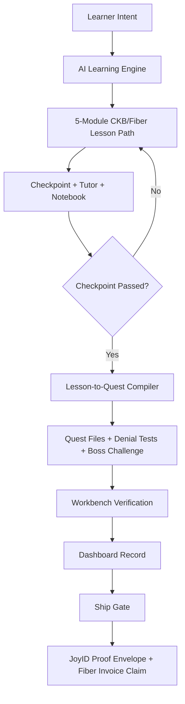

# VibeQuest Web

Next.js + TypeScript frontend for VibeQuest: an AI gamified CKB/Fiber learning workbench where users learn protocol concepts, generate practical quests, inspect code, pass verification gates, and record proof of understanding.

Requires Node.js `>=20.19.0`.

## Run

```bash
cp .env.example .env.local
npm install
npm run dev
```

`CORE_API_BASE_URL` points the Next.js API proxy at `vibequest-core`. The browser uses `/api/core` by default, so most deployments only need to set `CORE_API_BASE_URL` on the server.

## Environment

| Variable | Required | Default | Purpose |
| --- | --- | --- | --- |
| `CORE_API_BASE_URL` | No | `http://localhost:8080` | Server-side target for the Rust backend proxy. |
| `NEXT_PUBLIC_API_BASE_URL` | No | `/api/core` | Optional browser-visible override. Leave empty for normal deployments. |

## Product Shape

- AI-generated CKB/Fiber learning modules based on learner interests, background, and pace.
- Interactive checkpoints before practical quests unlock.
- Lesson-to-quest flow that generates code, denial tests, and boss challenges through `vibequest-core`.
- JoyID wallet binding through CCC for learner identity and reward-claim ownership.
- Workbench for generated file inspection, verification checks, code tutoring, and boss challenge completion.
- Dashboard for completed/incomplete lessons, related quests, tutor questions, and learner notebook reflections.
- Ship Gate for a JoyID-bound proof envelope and Fiber invoice-bound reward claim.

## Architecture Flow



| Layer | Responsibility |
| --- | --- |
| Next.js frontend | Learning UX, workbench, dashboard, wallet flow, ship gate |
| JoyID / CCC | Wallet binding for learner identity |
| Next.js API proxy | Browser-safe proxy to the Rust backend |
| `vibequest-core` | AI generation, quest compilation, verification state, persistence, reward claims |
| OpenAI Responses API | Lesson seeds, quest seeds, tutor explanations |
| MongoDB | Users, learning sessions, quest runs, tutor messages, reward claims |
| CKB/Fiber RPC | Readiness checks and ecosystem-specific quest context |

## Spark Proposal

The CKB Spark Program proposal is in [`docs/spark-proposal.md`](docs/spark-proposal.md).

## Paired Backend

Use `vibequest-core` for AI lesson generation, quest compilation, scoring, OpenAI calls, MongoDB persistence, CKB readiness, and Fiber reward orchestration.

## Checks

```bash
npm run lint
npm run build
```

## Docker

```bash
docker build -t vibequest-web .
docker run --rm -p 3000:3000 \
  -e CORE_API_BASE_URL=http://host.docker.internal:8080 \
  vibequest-web
```
