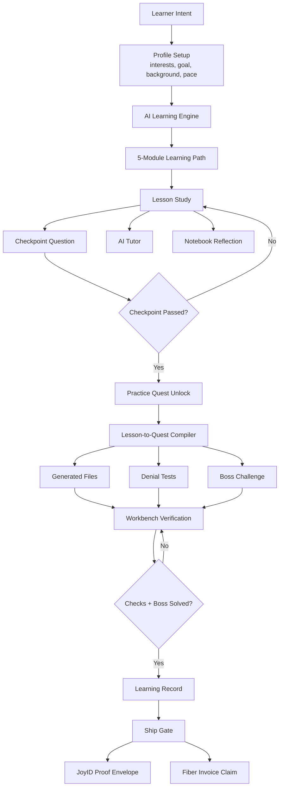
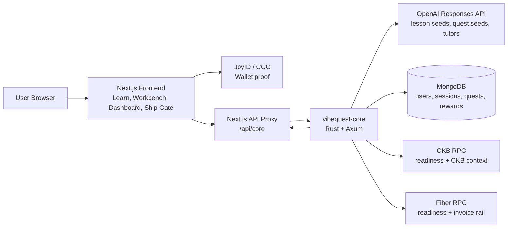
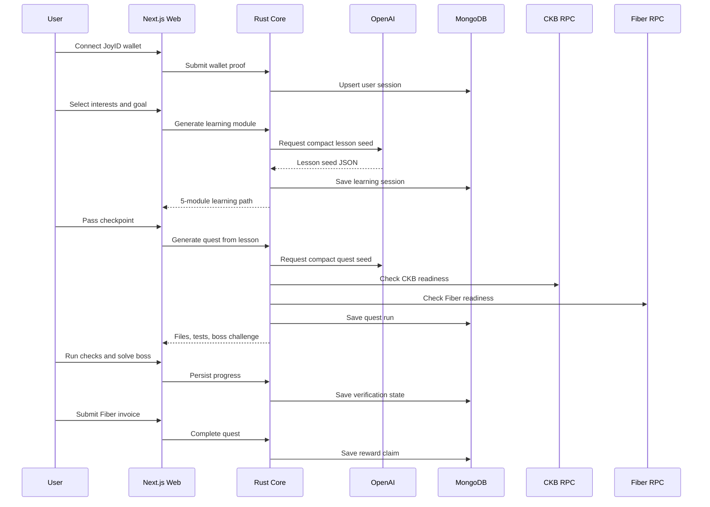
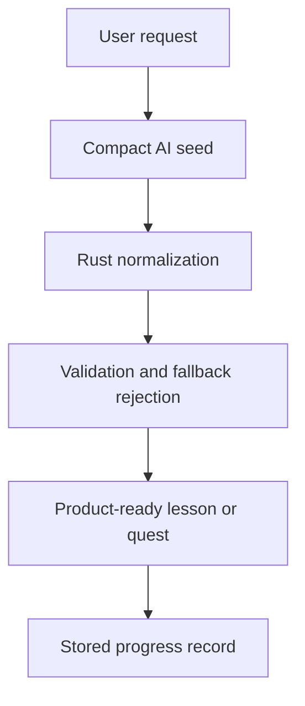

# VibeQuest Product Architecture

VibeQuest is an AI gamified CKB/Fiber learning workbench. The product goal is simple: users can vibe-code with AI, but they only progress when they understand the generated code, can explain the trust boundary, and can verify failure cases.

## Product Loop

## Runtime Architecture

## Dynamic Content Contract

VibeQuest is not a static quiz site or a repository of pre-written lessons. The product has a small set of learning lanes, but the lesson content, checkpoint questions, tutor answers, code quests, denial tests, code explainers, and boss challenges are generated at runtime from the learner profile and the active lesson.

The backend treats AI output as a draft artifact, not as trusted UI content. `vibequest-core` accepts a generated lesson or quest only when it matches the product contract:

| Artifact | Required Shape |
| --- | --- |
| Learning path | 5 modules, each with a clear concept, 300+ word explainer target, checkpoint, misconception, and practice bridge |
| Checkpoint | Lesson-specific question, shuffled options, correct answer, explanation, and follow-up |
| Tutor answer | Context-aware answer tied to the active lesson, plus a follow-up question |
| Code quest | Generated implementation file, generated test file, denial path, CKB/Fiber proof signal, and boss prompt |
| Code explainer | Primary invariant, proof artifact, denial path, network boundary, inspect steps, and learner prompts |

If the generated payload is incomplete, generic, or repeats a rejected scaffold, the backend rejects it and the UI asks the learner to regenerate. That keeps the product reviewable: every accepted quest must carry enough code, tests, and explanation for the learner to defend what the AI produced.

## Personalization Model

Personalization begins before generation. The learner chooses a learning lane, speciality, goal, and pace. Those inputs shape the learning path and every later quest.

| Input | How It Changes The Product |
| --- | --- |
| Learning lane | Selects the CKB/Fiber concept family, such as CKB Cells, Fiber payments, proof security, or wallet identity |
| Speciality | Changes framing for vibecoders, frontend builders, backend engineers, auditors, product/community learners, or researchers |
| Goal | Tells the AI what the learner is trying to understand or build |
| Pace | Controls lesson density, checkpoint difficulty, and explanation depth |
| Checkpoint result | Determines whether the learner unlocks practice or needs explanation |
| Tutor questions | Add context for later review and remediation |

The quest compiler uses the completed lesson, checkpoint answer, concepts, misconception, and practice bridge. A quest generated from a Fiber replay lesson should therefore test Fiber replay boundaries, not a generic verifier pattern.

## Cost And Maintenance Controls

Real-time AI is used where it creates learning value, not on every render. Generated paths, quests, tutor notes, and progress records are stored in MongoDB so refreshes and dashboard review do not trigger repeated model calls.

AI calls happen only for:

- creating a new learning path,
- asking the lesson tutor,
- turning a completed lesson into a quest,
- generating a custom quest from the Quest Run page.

The backend keeps prompts compact, requests structured JSON, validates the response, and stores accepted artifacts. This makes the grant-period MVP affordable while leaving room for post-grant operation through low-cost hosting, usage limits, ecosystem sponsorship, beta cohorts, or paid learning tracks if adoption grows.

## Core Product Surfaces

| Surface | Role | User Outcome |
| --- | --- | --- |
| Landing | Entry point and product framing | User understands VibeQuest is a learning workbench, not a generic generator |
| Learn | Interest-based modules, checkpoints, tutor, notes | User learns CKB/Fiber concepts before generating quests |
| Quest Run | Prompt and lesson-to-quest generation | User turns a learning objective into a practical quest |
| Workbench | Code explorer, file checks, code tutor, boss challenge | User verifies generated code and proves understanding |
| Dashboard | Lessons, quests, questions, notes, progress | User can resume, review, and track learning history |
| Ship Gate | Completion proof and reward claim preparation | User claims only after identity, checks, and boss proof pass |

## Data Ownership Flow

## Backend Responsibilities

`vibequest-core` owns the trust-sensitive work:

- Validate JoyID wallet proof shape.
- Generate learning modules through OpenAI and normalize them into product-safe lesson structures.
- Generate quest seeds through OpenAI and compile them into verified workbench files.
- Store users, learning sessions, quest runs, boss attempts, tutor messages, and reward claims.
- Check CKB RPC and Fiber RPC readiness.
- Enforce ship-gate completion requirements before reward claims are created.

## Frontend Responsibilities

`vibequest-web` owns the learner experience:

- Wallet connect and session persistence.
- Learning profile, lesson navigation, checkpoints, tutor chat, and notebook reflections.
- Quest prompt composition and lesson-to-quest handoff.
- Workbench file explorer, verification checks, code explainer, and boss challenge UI.
- Dashboard for review, resume, and progress history.
- Ship Gate status display and Fiber invoice submission.

## AI Generation Strategy

VibeQuest avoids asking the AI for huge, slow, fragile payloads. The backend asks for compact seeds, then expands and validates them into product-safe structures.

This keeps generation fast while still making the output feel specific and useful.

## Learning Record Model

The dashboard is designed around learning evidence, not infrastructure logs.

| Record | Purpose |
| --- | --- |
| Lesson status | Complete, attempted, or open |
| Checkpoint answer | Shows what the learner understood or missed |
| Tutor questions | Keeps the user's confusion and answers reviewable |
| Notebook reflection | Lets learners write what they learned in their own words |
| Related quests | Links lessons to generated code exercises |
| Quest history | Allows review, redo, or continuation |
| Reward claim | Shows completion and payout state |

## Ship Gate Rules

A run should only be claimable when:

1. JoyID proof is bound.
2. Backend generation services are ready.
3. MongoDB reward ledger is available.
4. Generated workspace checks pass.
5. Boss challenge is solved.
6. User submits a Fiber invoice.

If a step is incomplete, the UI should show it as `PENDING`, not as a system failure.

## Integration Boundaries

| Integration | Current Role | Future Role |
| --- | --- | --- |
| JoyID | Wallet identity and proof binding | Stronger account/session portability |
| CKB RPC | Readiness and CKB learning context | Proof receipts, badges, or on-chain learning attestations |
| Fiber RPC | Readiness and invoice-bound claim flow | Automatic testnet/mainnet payout rail through a funded node |
| MongoDB | Product state and history | Analytics, progress recovery, cohort views |
| OpenAI | Lessons, quests, tutors | Personalized learning paths and adaptive remediation |

## Verification Checklist

- `npm run lint`
- `npm run build`
- `cargo test` in `vibequest-core`
- Generate a learning path and confirm 5 modules render.
- Pass a checkpoint and generate a quest from the lesson.
- Run Workbench checks and solve the boss challenge.
- Confirm Dashboard stores lesson, quest, tutor, and notebook state.
