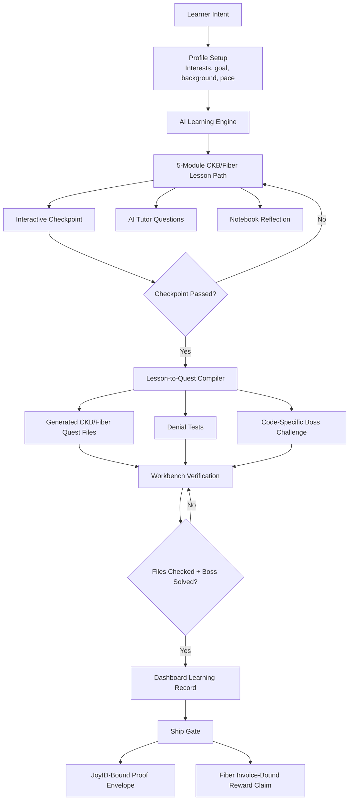
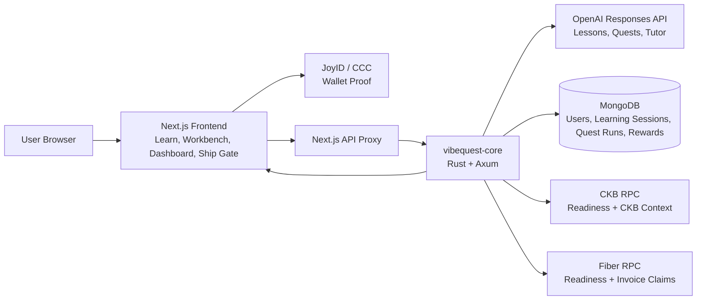

# Spark Program | VibeQuest: AI Gamified CKB/Fiber Learning Workbench

**Tag:** `Spark-Program`

## 1. Project Overview

**Project Name:** VibeQuest

**One-Sentence Summary:** VibeQuest is an AI-powered gamified learning workbench that teaches CKB, Fiber Network, JoyID, and xUDT concepts through interactive lessons, generated code quests, verification checks, and proof-based completion.

**Project Type:** DApp / AI Learning Platform / CKB-Fiber Onboarding Tool

## 2. Team Profile

**Core Team**

- **buidlLabs3** - product, frontend, backend, CKB/Fiber integration

**Repositories**

- Frontend: https://github.com/buidlLabs3/vibequest-web
- Backend: https://github.com/buidlLabs3/vibequest-core

**Contact**

- Email: `[add email before posting]`
- GitHub: https://github.com/buidlLabs3

## 3. Project Background

AI-assisted coding is now common, but many users generate code they cannot explain, audit, or safely modify. That is especially risky in CKB/Fiber because small misunderstandings around cells, witnesses, JoyID signatures, Fiber invoices, HTLC preimages, xUDT payout splits, or replay protection can create insecure apps.

Example scenario: a learner asks AI to build a Fiber paywall. The generated code may compile, but the learner may not know whether the receipt is bound to the reader, content, run id, CKB cell, amount, or channel state. VibeQuest turns that moment into a structured learning loop: learn the concept, answer checkpoints, generate a quest, inspect code, run verification checks, solve a boss challenge, and record progress.

## 4. Solution

VibeQuest provides:

- AI-generated CKB/Fiber learning modules based on user interest, background, and pace.
- Interactive checkpoints before users unlock practical quests.
- Code-aware quests that generate verifier snippets, denial tests, and boss challenges.
- A workbench where users inspect generated files, run checks, ask an AI tutor, and prove understanding.
- Dashboard records for completed lessons, incomplete lessons, related quests, tutor questions, and learner reflections.
- JoyID wallet binding for user identity and future reward claims.
- Fiber invoice-based reward claim flow for incentivized quests.

**Differentiation:** VibeQuest is not a docs page or a generic AI code generator. It teaches through generated code, failure cases, tests, proof-of-understanding gates, and saved learning history.

## 5. Clean Architectural Flow



The chart shows the intended product loop: users do not jump straight from AI output to rewards. They must learn, answer, inspect, verify, explain, and only then reach the ship gate.

### Runtime Architecture Chart



### Runtime Components

| Layer | Responsibility | Implementation |
| --- | --- | --- |
| Frontend app | Learning UX, workbench, dashboard, wallet flow, ship gate | Next.js, TypeScript, Tailwind |
| Wallet identity | Bind user sessions and claims to a CKB ecosystem wallet | JoyID through CCC connector |
| API proxy | Browser-safe route from web app to backend | Next.js API route |
| Core backend | AI generation, quest compilation, verification state, persistence, reward claim logic | Rust, Axum |
| AI layer | Generate lesson seeds, quest seeds, tutor explanations | OpenAI Responses API |
| Persistence | Store users, learning sessions, quest runs, progress, tutor messages, reward claims | MongoDB |
| CKB integration | CKB RPC readiness and CKB-specific lesson/quest concepts | CKB RPC |
| Fiber integration | Fiber RPC readiness and invoice-bound reward claim preparation | Fiber RPC |

### User Flow

1. User connects JoyID wallet.
2. User selects CKB/Fiber interests and learning background.
3. VibeQuest generates a 5-module learning path.
4. User studies a lesson, answers a checkpoint, asks the tutor, and writes notes.
5. Passed lessons unlock practice quests.
6. Backend generates CKB/Fiber quest files and denial tests.
7. User inspects code in Workbench and runs generated file checks.
8. User answers a code-specific boss challenge.
9. Dashboard records lesson status, quest history, questions, and reflections.
10. Ship Gate prepares a JoyID-bound proof envelope and Fiber invoice-bound reward claim.

### Data Flow

```text
JoyID proof
  -> backend wallet validation
  -> user/session identity

Learning request
  -> OpenAI compact lesson seed
  -> Rust expansion into deep modules
  -> MongoDB learning session
  -> frontend Learn + Dashboard views

Quest request
  -> OpenAI compact quest seed
  -> Rust verified quest builder
  -> generated files + tests + challenge brief
  -> MongoDB quest run
  -> Workbench verification

Completion request
  -> gate state + boss answer + wallet proof + Fiber invoice
  -> backend completion proof
  -> MongoDB reward claim
  -> optional Fiber payout rail when funded node is configured
```

## 6. Technical Approach

**Frontend Stack**

- Next.js
- TypeScript
- Tailwind CSS
- JoyID wallet connection through CKB CCC connector

**Backend Stack**

- Rust
- Axum
- OpenAI Responses API
- MongoDB
- CKB RPC
- Fiber RPC

**Key Technical Choices**

- Use compact AI outputs for speed, then expand them into structured lessons and quests in Rust.
- Require generated quests to include proof signals, tests, and denial paths.
- Keep learner progress separate from system logs so the dashboard functions like a learning record, not an infrastructure page.
- Use JoyID for wallet identity because it is more accessible for CKB users than requiring manual secp256k1 signing.
- Keep Fiber payout invoice-bound until a funded Fiber node is configured.

**Key Technical Challenges**

- Keeping AI generation fast enough for hosted serverless environments.
- Avoiding random or shallow AI-generated quests.
- Turning CKB/Fiber concepts into practical verification exercises.
- Preventing fake completion by requiring checks, boss answers, and wallet-bound state.

## 7. To-Do List

**Week 1: Learning Flow Hardening**

- Improve AI module generation for 5 structured lessons.
- Add clear submodules, code snippets, checkpoints, and explanations.
- Store learner progress and checkpoint state.

**Week 2: Dashboard + Notebook**

- Organize completed and incomplete lessons.
- Show lesson-related quests.
- Add learner reflection notebook.
- Display tutor questions and previous learning records.

**Week 3: Quest Generation Improvements**

- Generate quests from completed lessons.
- Improve code-specific boss questions.
- Add stronger wrong answers and teaching feedback.
- Ensure quests include proof, test, and denial-path signals.

**Week 4: Workbench Verification**

- Improve generated file checks.
- Add clearer completion success cards.
- Improve next-quest flow.
- Make past quests reviewable and resumable.

**Week 5: CKB/Fiber Integration Polish**

- Improve JoyID wallet binding flow.
- Strengthen CKB/Fiber terminology and reference trails.
- Prepare Fiber invoice-based reward claim flow.

**Week 6: Testing, Docs, Demo**

- Run full backend and frontend checks.
- Prepare demo guide.
- Publish verification instructions.
- Record demo video.

## 8. Required Funding & Breakdown

**Total Requested:** `$1,000`

| Milestone | Amount | Scope |
| --- | ---: | --- |
| Milestone 1: Learning Engine + Dashboard | $300 | AI learning modules, checkpoints, lesson progress, notebook/reflection records |
| Milestone 2: Quest Workbench + Verification | $350 | Lesson-to-quest generation, code-aware boss challenges, verification checks, quest history and resume flow |
| Milestone 3: CKB/Fiber Polish + Demo | $350 | JoyID flow polish, CKB/Fiber references, reward claim preparation, tests, docs, demo |

## 9. Deliverables + How to Verify

### Deliverables

- Public frontend demo URL.
- Public backend API URL.
- GitHub repositories with source code.
- AI learning module generation.
- JoyID wallet binding.
- Quest generation from completed lessons.
- Workbench file verification.
- Dashboard records and notebook.
- Ship Gate reward claim flow.
- README verification guide.
- Demo video.

### How to Verify

1. Open the demo URL.
2. Connect JoyID wallet.
3. Generate a learning path.
4. Confirm at least 5 lessons are created.
5. Complete a checkpoint.
6. Generate a quest from the lesson.
7. Run generated file checks in Workbench.
8. Answer the boss challenge.
9. Confirm Dashboard stores progress, questions, notes, and quests.
10. Run backend tests with `cargo test`.
11. Run frontend checks with `npm run lint` and `npm run build`.

**Expected Output**

- Learning path appears with 5 modules.
- Quest files appear in Workbench.
- Verification checks pass.
- Boss challenge completion unlocks success state.
- Dashboard shows learning and quest history.

**Environment Requirements**

- Node.js for frontend checks.
- Rust toolchain for backend checks.
- MongoDB URI for persistence.
- OpenAI-compatible API key for live AI generation.
- CKB RPC and Fiber RPC URLs for readiness checks.

## 10. Current State vs. Funded Work

**Current State**

- Frontend and backend repositories exist.
- Next.js frontend is deployed.
- Rust backend is deployed.
- OpenAI integration works.
- JoyID binding flow exists.
- MongoDB persistence exists.
- Basic learning, quest, dashboard, workbench, and ship-gate flows are implemented.

**Funded Work**

- Polish the product into a clear Spark-ready MVP.
- Improve lesson depth, quest quality, and user flow.
- Make history, notebook, and progress tracking production-ready.
- Improve CKB/Fiber learning accuracy and verification flow.
- Produce documentation and demo material.

## 11. CKB Alignment

VibeQuest directly supports CKB ecosystem onboarding by teaching and exercising:

- CKB Cell Model
- Lock/type scripts
- Witness data
- JoyID wallet proof binding
- Fiber invoices and payment channels
- HTLC preimage and replay risks
- xUDT payout logic
- Proof-based reward claims

The goal is to help more builders understand and safely build CKB/Fiber applications instead of blindly shipping AI-generated code.

## 12. Milestones

### Milestone 1: Learning Engine + Dashboard

**Budget:** `$300`

**Acceptance Criteria**

- User can generate a 5-module CKB/Fiber learning path.
- Each lesson includes submodules, code lens, checkpoint, and quest bridge.
- Dashboard shows completed/incomplete lessons.
- Dashboard includes learner notebook and tutor question history.

### Milestone 2: Quest Workbench + Verification

**Budget:** `$350`

**Acceptance Criteria**

- Passed lessons can generate practical quests.
- Quest includes generated files, tests, denial path, and code-specific boss challenge.
- Workbench can verify generated file signals.
- User can review or resume previous quests.

### Milestone 3: CKB/Fiber Polish + Demo

**Budget:** `$350`

**Acceptance Criteria**

- JoyID flow is clear and stable.
- Ship Gate clearly shows proof and reward-claim state.
- CKB/Fiber references are linked in learning and quest views.
- Public demo, README, and verification guide are available.
- Frontend and backend checks pass.
